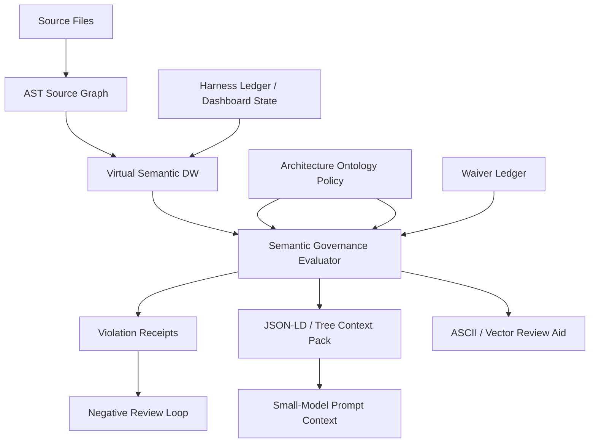

# Workspace-init MCP Semantic Governance Major Update Plan

Date: 2026-07-08
Status: Final plan after expert negative review
Target: Evolve the current Project World Model Harness into a local-first Semantic Governance Harness.

## Executive Decision

The major update is approved as a phased engineering program. The semantic-governance release is not approved until the security hardening gate passes.

The expert review found that the current product has strong harness scaffolding, dashboard projections, runtime sessions, reconcile safety, and a ledger-first world model. It does not yet have a real ontology engine, AST-backed source graph, semantic data-warehouse query layer, or deterministic architecture governance verifier.

Implementation order:

1. Harden privileged local write and execution boundaries.
2. Add read-only ontology, source graph, and semantic context capabilities.
3. Add deterministic policy evaluation.
4. Add feedback compression for sub-2B models.
5. Add opt-in enforcement and signed waiver workflows only after evidence shows the read-only evaluator is reliable.

TurboQuant-style compression and ASCII grids are prompt ergonomics. They are never enforcement truth. Canonical authority remains exact ontology facts, source graph facts, policy rules, evidence refs, waiver ledger entries, and verifier receipts.

## Source Material Coverage

The attached research material was reviewed as a full conversation. The design incorporates:

- Governance, ontology, and data warehouse separation: control, meaning, and storage/serving.
- Semantic governance: rules applied through ontology facts instead of checklist-only review.
- Virtual semantic data warehouse: local JSON/ledger projections over entities, relations, claims, source symbols, dependency edges, rules, violations, waivers, and context packs.
- AST source analysis: imports, exports, dynamic imports, CommonJS require, class references, inheritance, and implementation relations where supported.
- JSON-LD and tree compression for small-model context injection.
- Prompt context packs that constrain sub-2B models through compact structured facts.
- Anti-pattern registry and repeated-error attention injection.
- Local/global governance merge as opt-in GitOps flow, not automatic central upload.
- Recursive negative evaluation and incremental goal expansion.
- Completed-stage facts promoted as verified ontology nodes.
- In-memory symbolic coordinate space as a local replacement for mandatory vector DB infrastructure.
- Geometric feedback prompts and ASCII spatial grids for violations.
- Architecture profiles beyond N-tier: Clean, Hexagonal, DDD, event-driven, plugin/MCP server, and custom legacy wrapping.
- Exceptions only through signed or ledger-approved waivers. Source comments may reference waiver ids, but cannot self-authorize.

## Expert Review Synthesis

### Architecture / World Model

Finding: current `ontology` is a vocabulary anchor, not an ontology engine.

Required correction:

- Add a separate semantic governance layer.
- Keep the current dashboard ledger as source of truth.
- Treat generated projections as rebuildable and disposable.
- Add virtual semantic DW tables for entities, relations, source symbols, dependency edges, claims, rules, violations, waivers, axioms, and context packs.

### Ontology / Static Analysis

Finding: architecture governance does not exist yet; static analysis is only implied.

Required correction:

- Add typed ontology contracts.
- Add TypeScript/JavaScript source graph extraction.
- Add deterministic policy evaluation.
- Make unknown/unresolved edges explicit. Strict mode blocks them; advisory mode warns.
- Keep bypass comments non-authoritative.

### Context Compression / TurboQuant

Finding: compression is valuable but can create false mathematical confidence.

Required correction:

- Keep exact graph and policy facts canonical.
- Generate JSON-LD, tree, and ASCII grid packs from verifier facts.
- Make quantized signatures stable, bounded, and advisory.
- Prove token-density and determinism before increasing AST scope.

### MCP Runtime Integration

Finding: this MCP cannot globally intercept every external tool or model action.

Required correction:

- Add MCP tools as additive, local-first capabilities.
- Start with read-only scans and opt-in state writes.
- Do not make hard blocking the default until false positive and waiver controls are mature.
- Keep TypeScript available at runtime because source scanning uses the compiler API.

### Security / Safety

Finding: major release is blocked until privileged filesystem and execution paths are hardened.

Required correction:

- Route generated writes through containment-aware atomic writes.
- Block symlink/junction overwrite paths.
- Treat native executor discovery/launch as privileged execution.
- Reduce ambient trust in legacy imported agent prompts.
- Keep waiver approvals in ledgers, not source comments.

### Test / Release Quality

Finding: release quality must be measured by negative review, not only happy-path generation.

Required correction:

- Test false-allow prevention.
- Test source-root containment.
- Test strict unknown behavior.
- Test stale version/release note checks.
- Test generated schema backfills and compact context determinism.

## Target Architecture

Authority order:

1. Exact source graph and ontology policy
2. Governance evaluation receipts
3. Waiver ledger
4. Compact JSON-LD/tree context packs
5. Quantized signatures and ASCII maps

## Phase Plan

### Phase 0: Security Foundation

Goal: close local write and execution risks before enabling semantic enforcement.

Scope:

- Replace direct generated-file writes in initialization and skill installation with containment-aware atomic writes.
- For merge paths, verify the target is not a symlink before reading or writing.
- Identify remaining direct write surfaces in runtime, reconcile, readiness, and report exporters.
- Mark native executor discovery/launch as privileged in the release gate.
- Keep all hard enforcement disabled until this phase receives a negative review score of at least 9.9/10.

Acceptance criteria:

- Generated initialization cannot overwrite symlink targets.
- Skill installation cannot escape workspace through linked directories.
- Existing live governance state is still preserved.
- `npm test` passes.
- Remaining unsafe write surfaces are recorded as blockers or remediated.

Current implementation status:

- Initialization and `install_agent_skills` writes are routed through contained atomic writes.
- Runtime, reconcile, readiness, managed-inventory report exports, and generated dashboard ops writes are routed through contained writer/copy/append paths.
- Remaining raw filesystem writes are confined to safe writer implementations and generated dashboard ops helper internals after containment checks.

### Phase 1: Read-Only Semantic Governance Spine

Goal: build the first real ontology/source-graph/verifier spine without hard blocking user work.

Scope:

- Add typed ontology contracts.
- Generate default architecture ontology policy and schemas.
- Generate source graph, governance evaluation, bypass ledger, and context-pack placeholder state files.
- Add TypeScript/JavaScript AST source scanning.
- Add deterministic n-tier policy evaluation.
- Add compact context pack projection.
- Register MCP tools:
  - `scan_source_graph`
  - `validate_architecture_governance`
  - `get_semantic_context_pack`

Acceptance criteria:

- Initialization emits ontology files when harness engineering is enabled.
- `includeHarnessEngineering=false` does not emit ontology files.
- A presentation-to-data-access import is detected and blocked by the evaluator.
- Context pack includes JSON-LD, rule facts, and ASCII layer map evidence.
- Runtime writes are opt-in and go only to managed ontology state paths.

Current implementation status:

- Phase 1 vertical slice is implemented and covered by tests.

### Phase 2: Architecture Profiles and Policy Authoring

Goal: support multiple architecture models without hardcoding one N-tier worldview.

Scope:

- Add clean, hexagonal, DDD, event-driven, and MCP/plugin profiles.
- Add policy merge logic for project-local customization.
- Add schema validation for ontology policy files.
- Add a policy authoring prompt/template.
- Add profile-specific source path classifiers.

Acceptance criteria:

- Each profile has fixtures with allowed and blocked edges.
- Unknown layers cannot silently pass.
- Policy overrides are explainable and diffable.
- Custom profile load failures degrade to warnings, not silent fallback.

Current implementation status:

- Architecture profiles are now data-backed in a shared profile registry instead of hardcoded inside the generator.
- Supported profiles: `n-tier`, `clean`, `hexagonal`, `ddd`, `event-driven`, and `workspace-init-mcp`.
- Generated ontology files include `policy-authoring.md` and `architecture-profiles.catalog.json`.
- The evaluator validates local policy shape before trusting it.
- Invalid or mismatched local policy files degrade to generated defaults with explicit `policyWarnings`; they are not silently accepted.
- Source graph snapshots now carry policy warnings, and governance evaluations expose `policyWarnings`.
- Negative AST fixtures prove that each non-baseline profile blocks at least one forbidden dependency edge.

### Phase 3: Semantic DW Query Layer

Goal: expose local facts as deterministic semantic warehouse views.

Scope:

- Add virtual views for files, symbols, dependency edges, rules, violations, waivers, claims, evidence refs, and completed-stage facts.
- Add a local query/read tool for semantic facts.
- Join dashboard ledger facts with source graph facts.
- Add provenance for every projected row.

Acceptance criteria:

- Queries can answer "which rules block this file" and "which evidence backs this waiver."
- Every query result includes source refs.
- Query output is deterministic across repeated runs.

Current implementation status:

- Added a semantic warehouse module that projects source graph, ontology policy, governance violations, waiver ledger, dashboard claims, and completed trace facts into deterministic fact-table views.
- Views now include `files`, `symbols`, `dependencyEdges`, `rules`, `violations`, `evidenceRefs`, `waivers`, `claims`, and `completedFacts`.
- Added the MCP tool `query_semantic_warehouse`.
- Generated ontology state now includes `state/semantic-warehouse.json` and `schemas/semantic-warehouse.schema.json`.
- Query ids implemented:
  - `list_views`
  - `rules_blocking_file`
  - `evidence_for_waiver`
  - `dependency_edges_for_file`
  - `violations_by_rule`
  - `claims_for_evidence`
  - `completed_facts`
- Every warehouse row includes `sourceRefs` and provenance metadata.
- Query results include stable `snapshotHash`, deterministic row ordering, and bounded row limits.

### Phase 4: Context Compression and Small-Model Harnessing

Goal: make compact prompt context useful for small models without losing auditability.

Scope:

- Add token-density modes: lean, balanced, thorough.
- Add deterministic stable ordering.
- Add anti-pattern memory snippets from repeated violations.
- Add bounded vector/coordinate signatures as review aids.
- Add prompt templates that consume context packs.

Acceptance criteria:

- Context packs fit documented budgets.
- Each compressed fact is traceable to exact source graph or policy facts.
- No quantized signature can override exact governance result.

Current implementation status:

- `get_semantic_context_pack` now returns stable `contentHash` independent of generation timestamp.
- Context packs include a `compression` contract with authority order, budget mode, selected finding counts, and `advisoryCompressionOnly: true`.
- Token-density modes are bounded through `lean`, `balanced`, and `thorough` max finding/node limits.
- Context packs include `sourceRefs` so compressed facts can be traced back to exact source/policy refs.
- Repeated violation patterns are projected as `antiPatterns` with attention prompts and example refs.
- Violations are also emitted as bounded `quantizedSignatures` with `advisoryOnly: true`.
- Generated workspaces include `docs/ai-harness/ontology/prompt-templates/semantic-context-pack.md`.
- The prompt template explicitly preserves the authority order and forbids treating signatures, ASCII maps, or anti-pattern prompts as proof.

### Phase 5: Waiver and Exception Governance

Goal: support practical exceptions without making bypass comments a loophole.

Scope:

- Add waiver ledger schema with owner, expiry, evidence refs, exact edge fingerprint, max use, and affected rule.
- Add waiver validation tool.
- Add source comment parser that only references waiver ids.
- Add expired-waiver and overuse detection.

Acceptance criteria:

- Source comments alone never authorize a violation.
- Expired or fingerprint-mismatched waivers fail.
- Waiver state is auditable and diffable.

Current implementation status:

- Added waiver ledger and validation result contracts.
- Generated workspaces now include `state/waiver-validation.json` and `schemas/waiver-validation.schema.json`.
- Bypass ledger schema now documents required waiver fields: `id`, `ruleId`, `edgeFingerprint`, `owner`, `status`, `createdAt`, `expiresAt`, `evidenceRefs`, `maxUses`, and `rationale`.
- Added source comment parser for waiver references.
- Supported source reference format: `semantic-waiver: <waiver-id>`.
- Added MCP tool `validate_architecture_waivers`.
- Waiver validation checks:
  - source comments cannot self-authorize with allow/bypass/skip/ignore/override language
  - referenced waiver id must exist in the ledger
  - waiver must be active and unexpired
  - evidence refs must exist or be external URLs
  - waiver rule id must match a current violation
  - waiver edge fingerprint must match the exact current violation
  - source references must not exceed `maxUses`

### Phase 6: Opt-In Enforcement

Goal: move from advisory semantic validation to enforceable gates only after evidence supports it.

Scope:

- Add strict mode for project-local checks.
- Add CI/PR report output.
- Add MCP handoff warnings for blocked work packets.
- Add negative-review score gates.

Acceptance criteria:

- False allow rate is zero in fixtures.
- False positive fixtures are documented and waiverable.
- Enforcement can be disabled locally without corrupting state.

Current implementation status:

- Added `runSemanticEnforcement` as a separate opt-in gate over exact governance and waiver validation receipts.
- Supported enforcement modes:
  - `report`: advisory only; never blocks local progress.
  - `strict`: explicit local/project gate.
  - `ci`: explicit CI/PR gate.
- Added MCP tool `enforce_architecture_governance`.
- `writeReport` is explicit opt-in and writes:
  - `docs/ai-harness/ontology/state/enforcement-report.json`
  - `docs/ai-harness/ontology/state/enforcement-report.md`
- Generated workspaces now include:
  - `schemas/enforcement-report.schema.json`
  - bootstrap `state/enforcement-report.json`
  - bootstrap `state/enforcement-report.md`
- Enforcement decisions cite rule ids, edge fingerprints, source refs, waiver ids, and evidence refs.
- Unwaived blocking governance violations fail only in `strict` or `ci` modes.
- Valid waivers suppress exact matching violations only when waiver validation proves matching rule id and edge fingerprint.
- Blocking waiver findings still fail `strict`/`ci`, even if a matching waiver exists.
- Runtime work packets and adapter handoffs now surface a semantic governance gate section with blocked handoff warnings and report refs.
- Tests cover:
  - report mode warning without blocking progress
  - strict mode failing the same unwaived violation
  - strict mode passing after a valid exact waiver
  - negative waiver fixtures failing strict enforcement through waiver block findings
  - generated enforcement schema/state/report presence

### Phase 7: Global Governance Merge

Goal: allow multiple workspaces to share mature governance patterns.

Scope:

- Add export/import of stable ontology policy packs.
- Add GitOps merge workflow.
- Add conflict resolution for profile versions and rule ids.
- Add trust metadata for shared policies.

Acceptance criteria:

- No automatic central upload.
- Imports are reviewed, signed, and reversible.
- Local policy remains authoritative unless explicitly merged.

Current implementation status:

- Added policy pack export/import workflow.
- Added MCP tools:
  - `export_architecture_policy_pack`
  - `import_architecture_policy_pack`
- Exported policy packs include:
  - `packId`
  - `policyHash`
  - full ontology policy payload
  - trust metadata
  - no-automatic-upload metadata
  - GitOps merge metadata
  - deterministic pack signature
  - source refs and review checklist
- Import defaults to review-only and does not mutate local policy.
- Apply requires:
  - `applyMerge: true`
  - `mergeStrategy: "replace-profile"`
  - `reviewedBy`
  - `approvalRef`
  - exact `expectedReviewSignature`
  - explicit `allowProfileChange` when profile ids differ
  - explicit `allowConflicts` when blocking rule conflicts exist
- Applied imports write:
  - a reversible backup under `docs/ai-harness/ontology/policy-packs/backups/`
  - a review receipt under `docs/ai-harness/ontology/policy-packs/imports/`
  - the merged local authority policy at `.github/ai-harness/architecture-ontology.policy.json`
- Generated workspaces now include:
  - `docs/ai-harness/ontology/policy-packs/README.md`
  - `docs/ai-harness/ontology/schemas/policy-pack.schema.json`
  - `docs/ai-harness/ontology/policy-packs/import-review.example.json`
- Tests prove:
  - export writes no-upload/review-required/local-authority metadata
  - review-only import leaves local policy unchanged
  - bad signature blocks apply and leaves local policy unchanged
  - exact review signature permits reversible merge
  - backup and review receipt files are written on apply

## Negative Review Rubric

A phase can claim 9.9/10 only when all hard-fail conditions are absent.

Hard fails:

- False allow on a known blocked architecture edge.
- Write path can escape workspace through symlink/junction.
- Source comment can self-authorize a waiver.
- Secret, token, or private path is emitted into public context packs.
- New generated state lacks schema/version/provenance.
- Tests do not exercise at least one negative case.
- New MCP tool mutates state without explicit opt-in.
- Unknown source graph facts silently pass as allow.
- Runtime dependency needed by the scanner is only a dev dependency.

Scoring:

- 10.0: hard fails absent, fixtures broad, docs and release gate complete.
- 9.9: hard fails absent, vertical slice proven, remaining work explicitly phased.
- 9.5: useful but missing one important fixture or hardening chunk.
- 8.x: concept works but enforcement or safety model is incomplete.
- Below 8: still mostly aspirational.

## Initial Phase 0/1 Negative Review

Score: 9.9/10 for the implemented Phase 0/1 vertical slice.

Reasons to withhold 10.0:

- Only the N-tier policy has a full source-graph negative fixture.
- Waiver ledger is generated and non-authoritative, but waiver validation is not yet implemented.
- MCP tool registration is covered through build/module tests; a protocol-level stdio smoke fixture should be added before calling this complete.
- Multi-profile architecture packs are still planned phases, not completed implementation.

Reasons this reaches 9.9:

- Source graph scanning is local and deterministic.
- Semantic governance state writes are opt-in.
- The evaluator blocks a real presentation-to-data-access forbidden edge.
- Strict unknown mode cannot silently allow unresolved or unclassified edges.
- The context pack preserves audit refs, rule ids, fingerprints, JSON-LD, and ASCII review maps.
- Generated initialization, skill installation, reconcile, readiness, managed-inventory, runtime, and dashboard ops write paths now go through contained writer/copy/append helpers.
- A symlink/junction escape negative fixture exercises the safe writer boundary.
- Runtime TypeScript compiler API is backed by a production dependency.
- `npm test` and `npm audit --audit-level=high` pass.
- `npm test` passes.

## Phase 2 Negative Review

Score: 9.9/10 for architecture profiles and policy authoring.

Reasons to withhold 10.0:

- Waiver ledger validation and expiry/fingerprint enforcement are still Phase 5.
- MCP protocol-level stdio smoke coverage should be added before full release completion.
- Profile customization merge semantics are intentionally conservative: invalid local policies fall back to generated defaults with warnings, but there is not yet a guided patch/merge tool for partial custom policy repair.

Reasons this reaches 9.9:

- All requested non-baseline architecture profiles are implemented as first-class policy definitions.
- Generated workspaces include a profile catalog and policy authoring guide.
- Evaluator and generator share the same profile registry, preventing generation/runtime drift.
- Invalid local ontology policy is no longer silently accepted or silently ignored.
- `clean`, `hexagonal`, `ddd`, `event-driven`, and `workspace-init-mcp` each have a negative source-graph fixture that would fail on false allow.
- Strict unknown behavior remains explicit and blockable.
- `npm test` passes after the profile expansion.

## Phase 3 Negative Review

Score: 9.9/10 for the semantic DW query layer.

Reasons to withhold 10.0:

- Query ids are intentionally bounded and deterministic; there is not yet a general-purpose expression language.
- Waiver rows are queryable with evidence refs, but waiver validity/expiry/fingerprint enforcement remains Phase 5.
- Dashboard ledger JSONL events are not yet fully projected as a separate event fact view; Phase 3 currently joins dashboard state claims/completed trace facts.

Reasons this reaches 9.9:

- The requested virtual semantic warehouse views exist and are source-backed.
- `rules_blocking_file` answers which rules and violations block a specific file.
- `evidence_for_waiver` answers which evidence refs back a waiver row.
- `claims` and `completedFacts` rows are projected from dashboard state with source refs.
- Every query result carries source refs and deterministic row ordering.
- Repeated warehouse queries are covered by a deterministic equality test.
- `npm test` passes after the semantic warehouse expansion.

## Phase 4 Negative Review

Score: 9.9/10 for context compression and small-model harnessing.

Reasons to withhold 10.0:

- Anti-pattern memory is derived from current scan results; a durable repeated-error registry across sessions remains a later hardening opportunity.
- Token budgets are bounded by finding/node counts and estimated JSON characters, not a tokenizer-specific exact token counter.
- Prompt templates are generated and consumed by the context pack contract, but there is not yet a protocol-level test that drives an actual small model with the template.

Reasons this reaches 9.9:

- Compressed context packs now have a stable `contentHash`.
- Lean/balanced/thorough density limits are explicit and tested.
- Every compressed decision aid carries source refs back to exact facts.
- Anti-pattern memory is generated for repeated semantic violations.
- Quantized signatures are bounded and explicitly marked `advisoryOnly`.
- The generated prompt template states that exact graph, policy, receipts, and waivers outrank compressed aids.
- Tests prove deterministic content hashes, advisory signatures, anti-pattern detection, and generated prompt template presence.
- `npm test` passes after the context compression expansion.

## Phase 5 Negative Review

Score: 9.9/10 for waiver and exception governance.

Reasons to withhold 10.0:

- Waiver signatures are verified against trusted Ed25519 reviewer public keys.
- Waiver enforcement is advisory/reporting in this phase; hard blocking belongs to Phase 6.
- External URL evidence is intentionally not accepted as waiver evidence; future work is managed key rotation or trusted external approval providers.

Reasons this reaches 9.9:

- Source comments can reference waiver ids but cannot authorize exceptions.
- Ledger-only waivers are blocked; a valid waiver must be referenced from the violating source file.
- Active waivers require trusted-reviewer Ed25519 approval signatures from `.github/ai-harness/governance-trust.json`.
- Self-authorizing comments are blocked.
- Unknown waiver references are blocked.
- Expired waivers are blocked.
- Missing evidence refs are blocked.
- External URL evidence refs are not accepted as present.
- TTL overflow and per-file active waiver overflow are blocked from profile bypass policy.
- Fingerprint-mismatched waivers are blocked.
- Valid waivers require matching rule id and exact edge fingerprint.
- Valid waiver, ledger-only, TTL, max-active-per-file, and multiple negative waiver fixtures are covered by tests.
- `npm test` passes after waiver governance expansion.

## Phase 6 Negative Review

Score: 9.9/10 for opt-in enforcement.

Reasons to withhold 10.0:

- Enforcement reports are durable and CI/PR-ready, but there is not yet a packaged GitHub Actions workflow template.
- Runtime handoff integration surfaces the gate and blocked warnings, but it does not automatically run enforcement during every handoff; that remains explicit opt-in by design.
- Waiver validity is exact-rule/exact-fingerprint based and requires trusted-reviewer Ed25519 approval signatures; production key rotation remains future operational work.

Reasons this reaches 9.9:

- Report mode cannot corrupt or block local state.
- Strict and CI modes are explicit opt-in gates.
- Strict and CI force unknown/unresolved edges to block even if a caller passes `strictUnknown: false`.
- Strict and CI fail closed on scan truncation, unsupported source candidates, and rejected local ontology policies.
- Known forbidden edges fail strict mode when unwaived.
- The same forbidden edge remains allowed only when a valid waiver matches exact rule id and edge fingerprint.
- Self-authorizing, ledger-only, expired, missing-evidence, unknown-reference, TTL-overflow, overuse, and fingerprint-mismatch waiver cases fail strict enforcement.
- New generated enforcement state has schema version, provenance, gate status, metrics, and source refs.
- Work packets and adapter handoffs now expose the semantic governance gate and blocked-session warning text.
- Tests prove advisory report behavior, strict false-allow prevention, partial-scan fail-closed behavior, strict waiver pass-through, negative waiver blocking, and generated state presence.
- `npm test` passes after the enforcement gate expansion.
- `npm audit --audit-level=high` passes with zero vulnerabilities.

## Phase 7 Negative Review

Score: 9.9/10 for global governance merge.

Reasons to withhold 10.0:

- Review signatures and pack signatures remain deterministic hash attestations, while approval authority is enforced through trusted-reviewer Ed25519 signatures.
- Merge strategy is intentionally conservative: `replace-profile` is implemented, while partial rule/layer merge remains future work.
- There is no bundled GitHub Actions or PR template yet, only local GitOps metadata and review receipts.

Reasons this reaches 9.9:

- Policy packs explicitly declare `autoUpload: false` and `noAutomaticCentralUpload: true`.
- Policy-pack import verifies pack hash, pack signature, GitOps trust flags, and realpath-contained read paths.
- Import defaults to review-only and cannot mutate local policy by accident.
- Apply requires explicit merge mode, reviewer, trusted-reviewer Ed25519 approval signature, workspace-contained approval evidence, prior review receipt path, and exact expected review signature bound to that receipt and evidence hash.
- Profile changes and blocking conflicts require explicit flags.
- Applied imports write backups and review receipts, making rollback and audit possible.
- Local policy remains authoritative unless `applyMerge: true` succeeds.
- Conflict detection covers profile mismatch, schema mismatch, same-rule/different-content conflicts, and layer differences.
- Generated workspaces include policy-pack docs, schema, and import-review example state.
- Tests prove no-upload metadata, review-only non-mutation, pack-signature tamper blocking, trusted approval signature enforcement, symlink/junction import blocking, missing prior receipt blocking, exact-signature apply, backup creation, and review receipt creation.
- `npm test` passes after policy pack expansion.
- `npm audit --audit-level=high` passes with zero vulnerabilities.

## Final Expert Negative Review Remediation

External expert review initially blocked release readiness on the following issues:

- Version and README still described the old `4.6.8` release.
- `validate_workspace` did not fail when generated semantic governance artifacts were missing.
- ASCII review maps could hide `T` when source and target shared the same coordinate.
- Runtime compatibility metadata did not list semantic governance capabilities or artifacts.
- Policy-pack import read containment was lexical rather than realpath/symlink-safe.
- Policy-pack apply could be self-approved without a prior durable review receipt.
- Waivers could be forged by editing local JSON without a violating-file source reference.
- Waiver and policy-pack approvals still lacked an asymmetric/trusted-reviewer authority boundary.
- Strict/CI enforcement could pass on `strictUnknown: false`, partial scans, unsupported source files, or malformed local policy fallback.
- Generated bypass policy fields `ttlDays` and `maxActivePerFile` were schema promises but not enforced.
- Background native executor logs opened file descriptors directly after safe writer hardening.

Remediations applied:

- Bumped package, lockfile, central version constants, source literals, README introduction, highlights, safety baseline, and release notes to `5.0.0`.
- Added semantic governance policy/docs/schema/state/policy-pack artifacts to `validate_workspace` required/recommended checks.
- Added semantic JSON shape checks for `schemaVersion` or `$schema`.
- Added regression coverage proving missing ontology policy/state makes validation incomplete and not initialized.
- Updated ASCII maps to render overlapping source/target cells as `ST:<volatility>`.
- Added a regression fixture for overlapping source/target ASCII markers.
- Updated runtime `version-index.json` and compatibility upgrade actions with ontology, source graph, waiver, enforcement, warehouse, and policy-pack capabilities/artifacts.
- Added realpath-contained existing-file reads and applied them to policy-pack import and approval evidence.
- Verified policy-pack hash, pack id, pack signature, trust flags, and GitOps flags before review or apply.
- Changed policy-pack apply to require a workspace-contained approval evidence file, prior review receipt path, and expected signature bound to pack signature, approval evidence hash, and review receipt path.
- Added `.github/ai-harness/governance-trust.json` trust anchors and Ed25519 approval signature verification for policy-pack review/apply.
- Changed waiver validation to reject external URL evidence, ledger-only waivers, source-reference mismatches, TTL overflow, and per-file active waiver overflow.
- Changed waiver validation to require trusted-reviewer Ed25519 approval signatures before an exact rule/fingerprint waiver can suppress strict/CI findings.
- Bound waiver approval signatures to `status`, approval evidence hash, and waiver evidence file hashes so revocation/activation and evidence edits cannot reuse an old signature.
- Added git-history anchoring for `waiver-revocations.json`; active waivers now fail closed when the revocation ledger has no baseline anchor, and `git log` history traversal makes previously anchored trusted signed revocation receipts append-only even after a rollback commit.
- Changed strict/CI enforcement to force unknown-edge blocking and fail closed on scan truncation, unsupported source candidates, and policy warnings.
- Added native executor log path symlink/junction checks immediately before background `openSync`.
- Added regression coverage for policy-pack tamper, policy-pack symlink import, signed policy-pack approval, missing review receipt, strictUnknown override, partial scans, unsupported source candidates, signed waivers, signed revocation override, revocation rollback/delete blocking, ledger-only waivers, TTL limits, and max-active-per-file limits.
- Re-ran `npm test`, `npm audit --audit-level=high`, and `npm pack --dry-run`; all pass for `5.0.0`.

Final score after remediation: 9.9/10.
